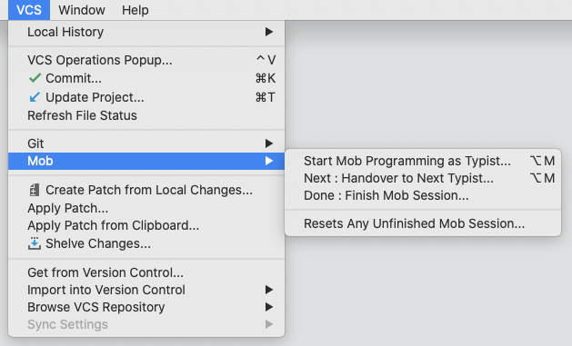
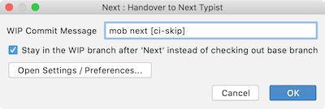
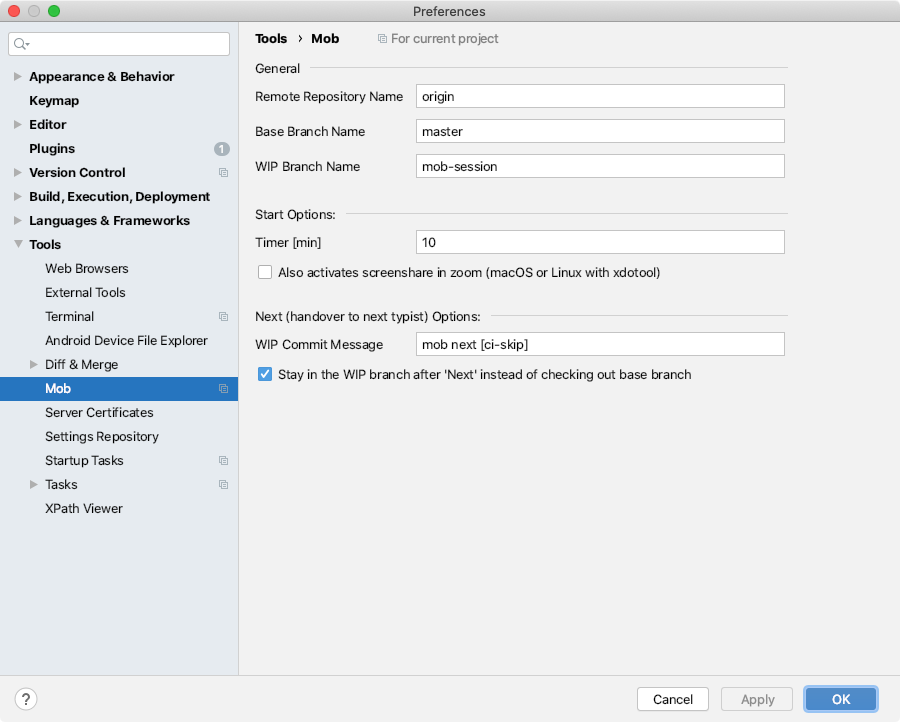
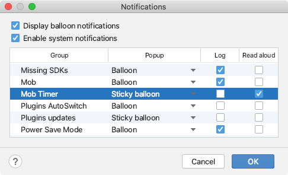

# Swift git handover with mob IntelliJ plugin

Swift [git handover](https://www.remotemobprogramming.org/#git-handover) and timer with mob IntelliJ plugin,
it useful for [Remote Mob Programming](https://www.remotemobprogramming.org).

- mob IntelliJ plugin is a port of [mob command line tool](https://github.com/remotemobprogramming/mob)
- mob is the fast way to [handover code via git](https://www.remotemobprogramming.org/#git-handover)
- mob keeps your `master` branch clean
- mob creates WIP commits on the `mob-session` branch
- mob notifies you when it's time to handover
- mob squash commits at done session and set `Co-authored-by:` trailer in commit message

## How to install

There are three ways to install.

### Stable channel of JetBrains Plugins Repository

1. Open Settings(Windows, Linux) / Preferences(macOS)... | Plugins
1. Search "Mob" and install

### EAP channel of JetBrains Plugins Repository

Alpha, Beta, and RC versions will only be released on EAP channel.

1. Open Settings(Windows, Linux) / Preferences(macOS)... | Plugins | :gear: | Manage Plugin Repositories...
1. Add `https://plugins.jetbrains.com/plugins/eap/list`
1. Search "Mob" and install

### Download from plugin page

1. Open [Mob - plugin for IntelliJ IDEs](https://plugins.jetbrains.com/plugin/14266-mob) page and download latest zip file
1. Open Settings(Windows, Linux) / Preferences(macOS)... | Plugins | :gear: | Install Plugin from Disk...
1. Select downloaded zip file to install plugin

## How to use

Git | Mob | Start Mob Programming as Typist... (shortcut: ALT+M, S)

Click OK, so switched to a separate branch. Start mob programming!

When handover to the next person,

Git | Mob | Next : Handover to Next Typist... (shortcut: ALT+M, N)

Continue with "Start" and handover to the next person with "Next".
Continue with "Start" and handover to the next person with "Next".
Continue with "Start" and handover to the next person with "Next".
...

When you're done,

Git | Mob | Done : Finish Mob Session... (shortcut: ALT+M, D)

After confirm in a dialog,
get your changes into the staging area of the `master` branch. 
Please commit & push into base branch yourself.

## How does it work

- Start Mob Programming as Typist : creates branch `mob-session` and pulls from `origin/mob-session`
- Next : pushes all changes to `origin/mob-session`in a `mob next [ci-skip]` commit
- Done : squashes all changes in `mob-session` into staging of `master` and removes `mob-session` and `origin/mob-session`
- Set "Timer" in start dialog : start a specific minute timer, notify by a balloon if expired
- Select "Also activates screenshare in Zoom" in start dialog : start screen sharing in Zoom (requires Zoom configuration)
- Select "Stay in WIP branch after executing 'Next' and checkout base branch" in next dialog : after handover code, stay on mob session branch
- Resets Any Unfinished Mob Session : deletes `mob-session` and `origin/mob-session`

### Zoom Screen Share Integration

The "Also activates screenshare in Zoom" feature uses the Zoom keyboard shortcut "Start/Stop Screen Sharing". This only works if you

- make the shortcut globally available (Zoom > Preferences > Keyboard Shortcuts), and
- keep the default shortcut at CMD+SHIFT+S (macOS)/ ALT+S (Windows, Linux).
- setting under System Preferences required on macOS Catalina (or later?); Security & Privacy -> Privacy tab -> Accessibility, and add your IntelliJ Platform Based IDEs .app

[More tips on setting up Zoom for effective screen sharing.](https://effectivehomeoffice.com/setup-zoom-for-effective-screen-sharing/)

## How to configure

Open Settings(Windows, Linux) / Preferences(macOS) | Tools | Mob

Settings are saves to `.idea/mob.xml`.

If you want a voice notification when the timer expires,
open Notifications settings and turn on "Read aloud" on "Mob Timer" row (macOS only).

There are two ways to open Notification settings.

- Preferences... | Appearance & Behavior | Notifications
- Event Log window | :wrench:

## Troubleshoot

To see `idea.log`, in JetBrains Toolbox, open Settings | Configuration, and click "Show logs directory" button.

If necessary, get the trace level log.
Open Help | Diagnostic Tools | Debug Log Settings…, and input `#com.nowsprinting.intellij-mob:trace`.

## Milestones

### 1.1

- Good looking timer widget on statusbar
- Pause/resume timer action launch from statusbar

### 1.x

- Integration tests
- Refactor: dialogs uses `DialogWrapper`
- Refactor: tests about `GitRepository`
- Input validation on dialogs
- Support multiple repository
- Can rollback on "done" by splitting the done process into two phases

## How to contribute

Open an issue or create a pull request.

## Credits

Original [mob](https://github.com/remotemobprogramming/mob) developed and maintained by [Dr. Simon Harrer](https://twitter.com/simonharrer).

<!-- Original contributions and testing by Jochen Christ, Martin Huber, Franziska Dessart, and Nikolas Hermann. Thank you! -->

Original and plugin logo designed by [Sonja Scheungrab](https://twitter.com/multebaerr).

Port to IntelliJ plugin by [Koji Hasegawa](https://twitter.com/nowsprinting)